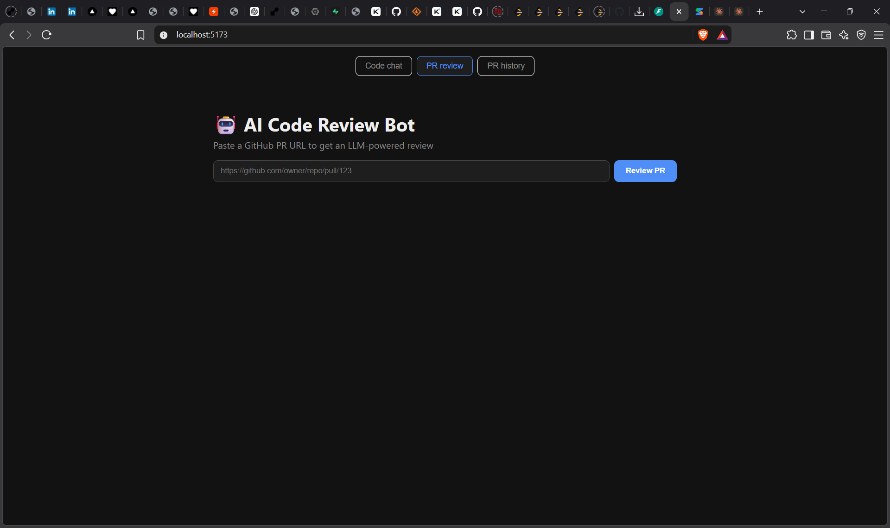
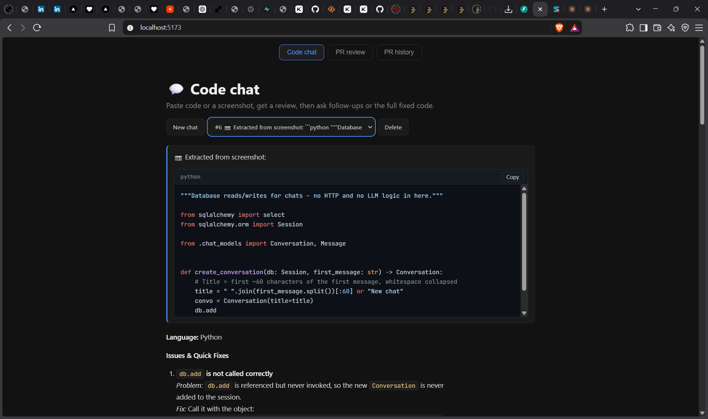
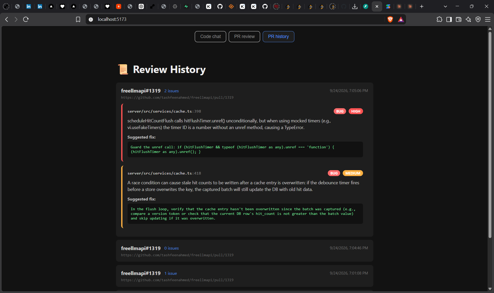

# AI Code Review Bot

Two ways to get an LLM-powered code review:

- **PR review** — paste a GitHub Pull Request URL and get bugs, security issues and
  suggested fixes, grouped by severity. Every review is saved, so past results can be
  opened from a History page.
- **Code chat** — paste code in any language, or a screenshot of code, and get the same
  kind of review. Ask follow-up questions or request the complete fixed file, with the
  conversation remembered until you start a new chat.

The LLM is a pre-trained model called through an OpenAI-compatible API. No model
training is involved. The work in this project is the integration: GitHub API, prompt
and response handling, persistence, API design and the UI.





## Architecture

```
React (Vite)  --->  FastAPI  --->  github_client  --->  GitHub REST API
   UI                routers            |
                        |               +--->  llm_reviewer   --->  LLM chat API
                        |               +--->  chat_service   --->  LLM chat API
                        |                                            (+ vision model
                        |                                             for screenshots)
                        +--->  storage / chat_storage (SQLAlchemy)  --->  SQLite
```

- `routers/reviews.py`, `routers/chats.py`: the only layers that know about HTTP
  (status codes, response models)
- `github_client.py`: parses the PR URL, fetches the diff and metadata
- `llm_reviewer.py`: sends a PR diff to the LLM and parses the structured issues it returns
- `chat_service.py`: drives the Code chat feature — resends the full conversation on
  every follow-up (the LLM has no memory of its own), and reads a screenshot once with a
  vision model before switching back to the regular text model
- `storage.py` / `chat_storage.py`, `models.py` / `chat_models.py`, `database.py`: persistence
- `schemas.py` / `chat_schemas.py`: request and response validation (Pydantic)
- `frontend/src`: `api/client.js` (all backend calls), pages and components — `ChatPage.jsx`
  is the code-chat UI (markdown rendering, syntax-highlighted code blocks, screenshot paste/attach)

## Tech stack

FastAPI, SQLAlchemy, SQLite, Pydantic, React 18, Vite, Docker, nginx.

## Run locally

Backend (from `backend/`):
```
python -m venv venv
venv\Scripts\activate
pip install -r requirements.txt
uvicorn app.main:app --reload --port 8000
```
Create `.env` (project root) with `GITHUB_TOKEN`, `LLM_API_KEY`, `LLM_BASE_URL`,
`LLM_MODEL`, `LLM_VISION_MODEL` and `DATABASE_URL`. `LLM_VISION_MODEL` can be left
empty — screenshot support is simply disabled until it's set.

Frontend (from `frontend/`):
```
npm install
npm run dev
```
Open http://localhost:5173. API docs are at http://localhost:8000/docs.

## Run with Docker

```
docker compose up --build
```
App on http://localhost:3000, API on http://localhost:8000. The SQLite file lives on a
named volume, so data survives restarts.

## API

| Method | Path | Purpose |
|---|---|---|
| POST | `/reviews` | Review a PR (`{"pr_url": "..."}`), save and return the result |
| GET | `/reviews` | Recent reviews, newest first (`limit`, `offset`) |
| GET | `/reviews/{id}` | One review with all its comments |
| POST | `/chats` | Start a chat (`{"content": "...", "image": "data:image/png;base64,..."}` — either field, or both) |
| POST | `/chats/{id}/messages` | Follow-up message in an existing chat |
| GET | `/chats` | Recent chats, newest first |
| GET | `/chats/{id}` | One chat with all its messages |
| DELETE | `/chats/{id}` | Delete a chat |
| GET | `/health` | Liveness check |

Errors: `422` for an invalid PR URL or request body, `502` when GitHub or the LLM
fails, `400` for a screenshot with no vision model configured, `404` for an unknown
review or chat.

## Design decisions

- **Layered backend.** Routes handle HTTP, other modules handle GitHub, LLM and
  storage. Each can be tested or replaced on its own.
- **Failures are recorded** for PR reviews, so a failed attempt still shows up in
  History with its error. Chat messages are saved only after the LLM call succeeds, so
  a failed request never leaves a half-written conversation.
- **Screenshots are read once.** A vision model transcribes the code to text (shown in
  the chat as "📷 Extracted from screenshot") and the rest of the conversation — review,
  follow-ups, the full fixed code — runs on the normal text model, without resending the
  image.
- **Full conversation resent on every chat message**, since the LLM itself has no
  memory between calls; the history is trimmed once it gets long.
- **Large PR diffs are truncated.** The API reports `was_truncated` and the UI warns
  that only the first part was reviewed.
- **High severity first** in PR review results, since those are the most actionable.
- **Config from environment variables**, validated at startup, no secrets in code.
- **Same-origin API calls.** Vite proxies `/reviews` and `/chats` in dev and nginx does
  in Docker, so the frontend uses relative URLs.

## Limitations

- LLM output is not deterministic — the same PR reviewed twice can report different
  issues, at different line numbers, with different severities. The reviewer is a
  second opinion, not a guarantee.
- A screenshot is transcribed by a separate vision model, which can misread a
  character or the indentation; the extracted code is shown before review so this can
  be checked.
- The review runs inside the HTTP request, so a slow LLM means a slow response.
- No authentication or per-user history.
- SQLite suits a single instance only.

## Future improvements

- Run reviews as background jobs and poll for status
- Post PR comments back to GitHub through its API
- Add login and per-user history
- Use Postgres and add a response cache
- Send diffs to the LLM with explicit line numbers, to make reported line numbers more reliable
- Measure PR-review quality against PRs with known bugs
